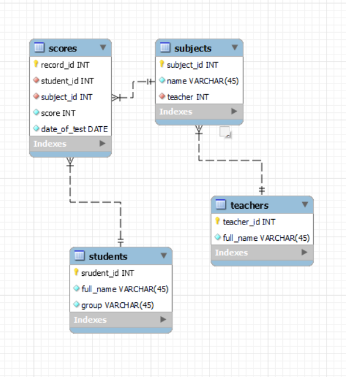

[ER-Diagram](README.md) 

| Field        | Type | Null | Key | Default | Extra |
|--------------|------|------|-----|---------|-------|
| record_id    | int  | NO   | PRI | NULL    |       |
| student_id   | int  | NO   | MUL | NULL    |       |
| subject_id   | int  | NO   | MUL | NULL    |       |
| score        | int  | NO   |     | NULL    |       |
| date_of_test | date | NO   |     | NULL    |       |

| Field      | Type        | Null | Key | Default | Extra |
|------------|-------------|------|-----|---------|-------|
| student_id | int         | NO   | PRI | NULL    |       |
| full_name  | varchar(45) | NO   |     | NULL    |       |
| group      | varchar(45) | NO   |     | NULL    |       |

| Field      | Type        | Null | Key | Default | Extra |
|------------|-------------|------|-----|---------|-------|
| subject_id | int         | NO   | PRI | NULL    |       |
| name       | varchar(45) | NO   |     | NULL    |       |
| teacher    | int         | NO   | MUL | NULL    |       |

| Field      | Type        | Null | Key | Default | Extra |
|------------|-------------|------|-----|---------|-------|
| teacher_id | int         | NO   | PRI | NULL    |       |
| full_name  | varchar(45) | NO   |     | NULL    |       |

